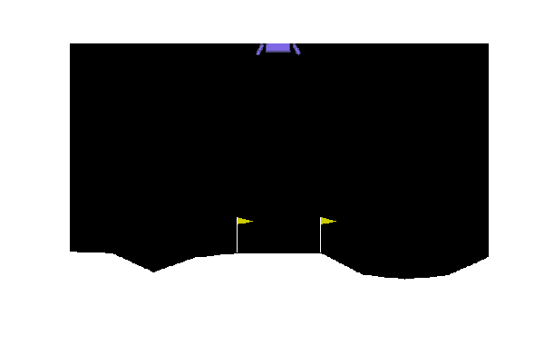

# OpenAI-LL-RLFam
<h2>Applying all known RL models to the OpenAI LunarLanding-v2 Environment</h2>

:--:
*Lunar Lander via DQN*

<h3>Setting up the Environment:</h3>
<ul>
  <li>Using Python v3.7 (Anaconda)</li>
</ul>

    pip install gym
    pip install Box2D

<h3>Starter Code (to render the ship and take random actions):</h3>

    import gym

    def run(epochs=10):  # Epochs: number of rounds the ship should take.
        printer = Printer()
        for epoch in range(epochs):
            print("EPOCH ------> {}".format(epoch+1))
            done = False
            while not done:
                env.render()  # Allows you to view the ship
                
                action = env.action_space.sample()  # Random Action
                obs, reward, done, info = env.step(action)

                if done:
                    obs = env.reset()
        env.close()

    if __name__ == "__main__":
        env = gym.make('LunarLander-v2')
        env.reset()
        run()

<h3>Applied Models</h3>
<ol>
  <li><b>Q Learning</b>       --->(1000 best: -201.579)</li>
  <li><b>SARSA</b>            --->(1000 best: -199.765)</li>
  <li><b>Dyna Q</b>           --->(1000 best: -194.17)</li>
  <li><b>Dyna Q+</b>          --->(1000 best: -173.74)</li>
  <li><b>Priority Sweeping</b>       --->(1000 best: -146)</li>
  <li><b>Deep Q Networks</b>  --->(1000 best: 236.30)</li>
</ol>

Report:
[Reinforcement Learning Family](https://docs.google.com/document/d/e/2PACX-1vT93-GN6mdClP1zJeyTQUk2YdvQiipTWF4P3O8rW2fca_JH6bMEyQUf8SWP5oTRUD1VP96l5-bfPzYg/pub).
